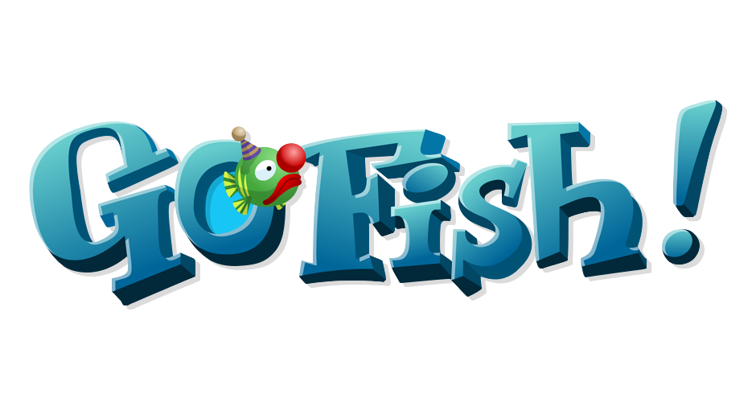
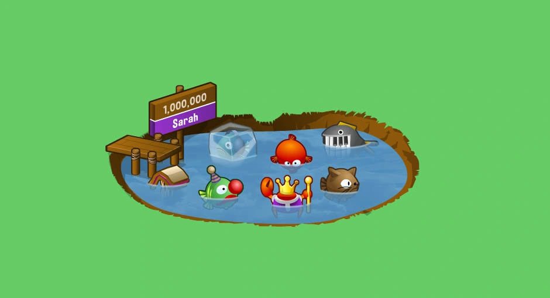
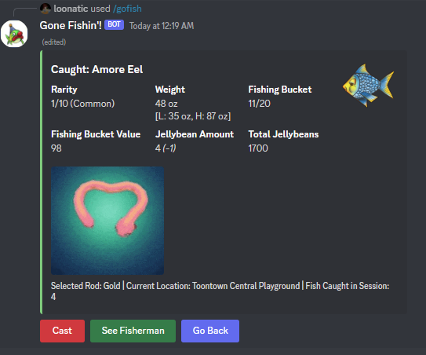
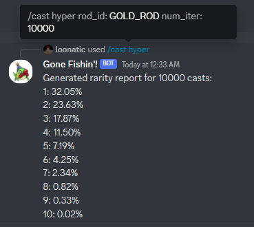

# Gone Fishin'! - Toontown Fishing Simulator

## NOTICE
This bot is currently a work in progress and contains a lot of placeholder and junk files leftover. Thank you for noticing. :)

## Features

- 100% original fishing logic and probabilities from Toontown Online.
- Stores fish data, including fish records, jellybeans, rod type etc. in a local database that persists each session
- Free Play Mode, which supports:
	+ Equippable fishing rods
	+ Ponds from every location in Toontown
	+ Fish statistics
	+ A Jellybean economy based around fishing!
	+ Free Play mode is still under construction and isn't fully ironed out yet.

	
### Experimental Features

- Auto sim commands:
	+ /cast hyper
	+ /cast mega

### Desired Features
- Nice way to view your fish records, like from the fishing page in your Stickerbook
- Campaign Mode!
- Fish Bingo, somehow.